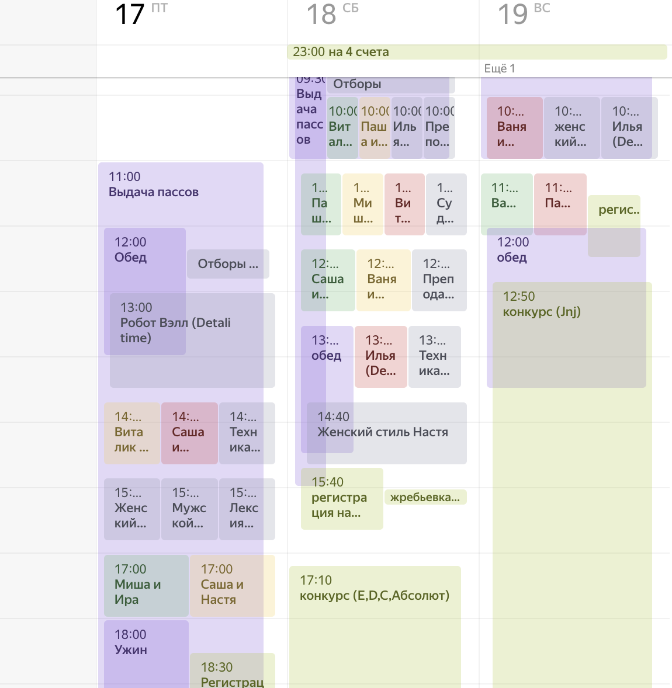
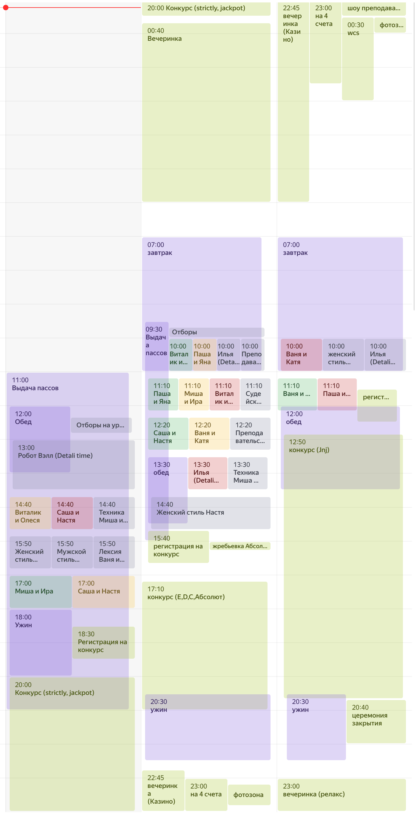

## NordCup 2023

Уже традиционно собрал расписание в календарь.

Ценная возможность видеть день в "реальном масштабе" и настоящие пересечения. Плюс не загромождать себя не нужными классами.

#### Классы:

- все уровни https://calendar.yandex.ru/export/ics.xml?private_token=ce967188c7fdf6fe8b3c43c0881c1efe02a6a2c8&tz_id=Europe/Moscow

- BG https://calendar.yandex.ru/export/ics.xml?private_token=ae2f2f206b5c66a5e85d44eda573e882f3335523&tz_id=Europe/Moscow

- RS https://calendar.yandex.ru/export/ics.xml?private_token=0df6d72cc64ea70674ff4ae1985270c04c2eccf9&tz_id=Europe/Moscow

- M https://calendar.yandex.ru/export/ics.xml?private_token=4d849eb1b4461d9aaf2e44d3b7bfcab6c8c43fef&tz_id=Europe/Moscow

#### Конкурсы/вечеринки
- конкурсное https://calendar.yandex.ru/export/ics.xml?private_token=18cdcf7ea51151a805184140acc93cbab10d702c&tz_id=Europe/Moscow

#### Инфраструктура
- обеды и пр https://calendar.yandex.ru/export/ics.xml?private_token=f3f20c3c21470295e9a2408ba967d2cb5ca95eb8&tz_id=Europe/Moscow

### Как импотриторвать в телефон

#### Android (импорт событий)
Все события в вперемешку
- открыть на телефоне нужные ссылки на календари, открыть скачанные файлы (будет список событий в календаре) и нажать "добавить все" (все события перенесутся в один календарь)

#### Android (импорт календаря)
Все календари будут видны по отдельности, можно будет выключать не нужны и даже будут подтягиваться изменения в расписании.
- на десктопе импортировать каждый календарь, все события прорастут в календарь на телефоне. При этом можно будет "на лету" смотреть только нужные календари:
  - открыть https://calendar.google.com/calendar/
  - добавить календарь - "Other calendars" -> "+" -> "From URL" -> вставить ссылку на календарь (см выше) -> "Add calendar"
  - повторить

#### Apple
- ??? возможно будет достаточно просто отрыть ссылки

